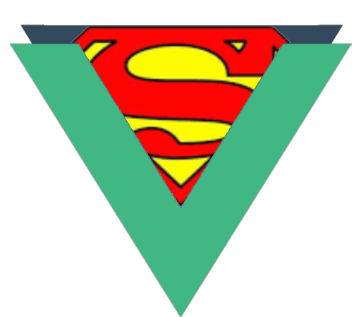

# Vue-Super

  <a href="https://vuejs.org" target="_blank" rel="noopener noreferrer">
    <!--  -->
    
  </a>

一个适用于团队协同开发的 vue3 项目模板。  
非常 nice!

---

技术栈: Vue3 + Typescript + Vite + VueRouter4 + Pinia + Axios + Element-Plus  
代码质量校验与代码风格校验: Eslint, Prettier, Stylelint  
git 提交信息校验: Commitlint

在线地址: https://vue-super.vercel.app/

[框架模板搭建过程记录](./RECORD.md)
